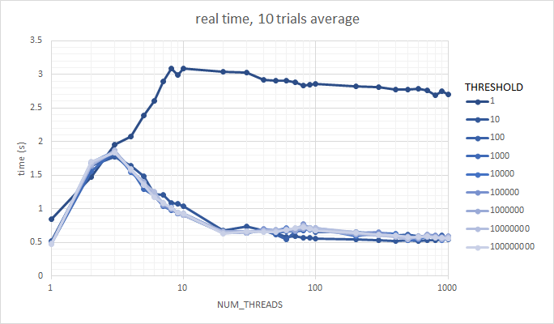
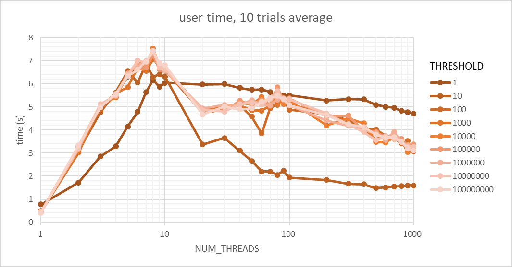
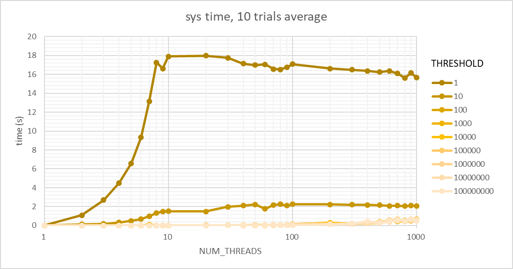

# Operating System

## "Pthreads"

Shu Sakamoto  
71775236  
t17523ss  

### Problem 1

> Determine the number of cores on your CPU.

By using `grep cpu.cores /proc/cpuinfo | sort -u `, which returns  
`cpu cores	: 4`,  
we can determine that the number of cores on my CPU is 4.  
(Reference: https://access.redhat.com/ja/solutions/2159401)

### Problem 2

> Vary NUM_THREADS from 1 to 1000 in some reasonable step size. Execute and record the time taken. On a Mac or Linux, use the ”time” command. You should have real (wall clock), user and system time.

I have ran `t2-lock-var.c` 10 times each with NUM_THREADS varying in a log-ish scale (`1, 2, 3, ..., 10, 20, 30, ..., 100, 200, 300, ..., 1000`). THRESHOLD also varies but in an actual log scale (`1, 10, 100, ..., 100000000`). Result of `time` command was redirected to a file `result.txt`, and this was formatted in to `result.csv` using regular expression replacement (replacing `\nreal\t0m(\d+\.\d+)s\nuser\t0m(\d+\.\d+)s\nsys\t0m(\d+\.\d+)s` with `$1,$2,$3`). From `result.csv`, average run time was calculated with some graphs drawn (`result.xlsx`). See `lock.sh` for actual implemantation.  

### Problem 3

> Plot those in interesting/pretty ways that tell us something about the performance. What number of threads performs best? Is that constant, or does it depend on the size of the update threshold?

  
  
  
Fig. 1. A line plot graph of `time ./t2-lock-var.out`. Average of 10 trials are plotted in seconds. real (top), user (middle), sys (bottom) time are shown.  

- We can notice that for most THRESHOLD, real time makes its peak when NUM_THREADS\==3, user time does when NUM_THREADS\==9, and sys time does not.
- real-wise, multiprocessing is most inefficient when NUM_THREADS equals to the number of CPU cores?
- user-wise, multiprocessing is most inefficient when NUM_THREADS equals to two times the number of CPU cores?
- It is interesting to see that when THRESHOLD\==1, real and sys time (and maybe user time?) is constant after NUM_THREADS\>8, two times the number of CPU cores. 